# ☁️ Cloud-Based Portfolio Website Deployment using AWS

<p align="center">
  
  
  
  
  
  
  
  
</p>

<p align="center">
  <b>A production-style personal engineering portfolio, built with vanilla HTML/CSS/JS and deployed through an automated CI/CD pipeline to Amazon S3 — created as part of the Decodelabs Cloud Computing Internship.</b>
</p>

<p align="center">
  <a href="https://tayyabjamil628-stack.github.io/Portfolio-website/"><b>🔗 Live Demo</b></a>
</p>

---

## 📖 Table of Contents

- [Project Overview](#-project-overview)
- [Live Demo](#-live-demo)
- [Project Architecture](#-project-architecture)
- [Features](#-features)
- [Technology Stack](#-technology-stack)
- [Project Structure](#-project-structure)
- [Cloud Architecture](#-cloud-architecture)
- [CI/CD Pipeline](#-cicd-pipeline)
- [Security](#-security)
- [Deployment](#-deployment)
- [Challenges and Solutions](#-challenges-and-solutions)
- [Testing](#-testing)
- [Screenshots](#-screenshots)
- [Future Improvements](#-future-improvements)
- [Project Documentation](#-project-documentation)
- [Learning Outcomes](#-learning-outcomes)
- [Author](#-author)
- [License](#-license)

---

## 🧭 Project Overview

This repository contains **Malik Tayyab Jamil's personal engineering portfolio**, developed during his **Cloud Computing Internship at Decodelabs**. The goal of the project was to design, build, and deploy a fully static, responsive, accessible portfolio website — and, critically, to learn and apply real-world **AWS cloud deployment and CI/CD practices** rather than relying on manual uploads.

The site is built as a **zero-framework, static web application** (semantic HTML5, modular CSS3, and vanilla ES6+ JavaScript) and is automatically synced to an **Amazon S3 bucket** on every push to `main` via a **GitHub Actions** workflow, demonstrating an end-to-end cloud deployment pipeline: **code → version control → automated build/deploy → cloud storage → global delivery.**

## 🌐 Live Demo

**🔗 [https://tayyabjamil628-stack.github.io/Portfolio-website/](https://tayyabjamil628-stack.github.io/Portfolio-website/)**

> The site is currently served publicly via **GitHub Pages**, while the repository's GitHub Actions workflow additionally and automatically deploys every push to an **Amazon S3 bucket** as part of the internship's AWS deployment exercise.

---

## 🏗️ Project Architecture

```
Developer
   ↓
GitHub (source control)
   ↓
GitHub Actions (CI/CD automation)
   ↓
Amazon S3 (static file storage)
   ↓
Amazon CloudFront (global CDN) *
   ↓
Users
```
`* CloudFront/OAC/IAM distribution setup is documented in this repo as the intended production architecture (see docs below); the live demo link above is currently served through GitHub Pages.`

### Mermaid Diagram

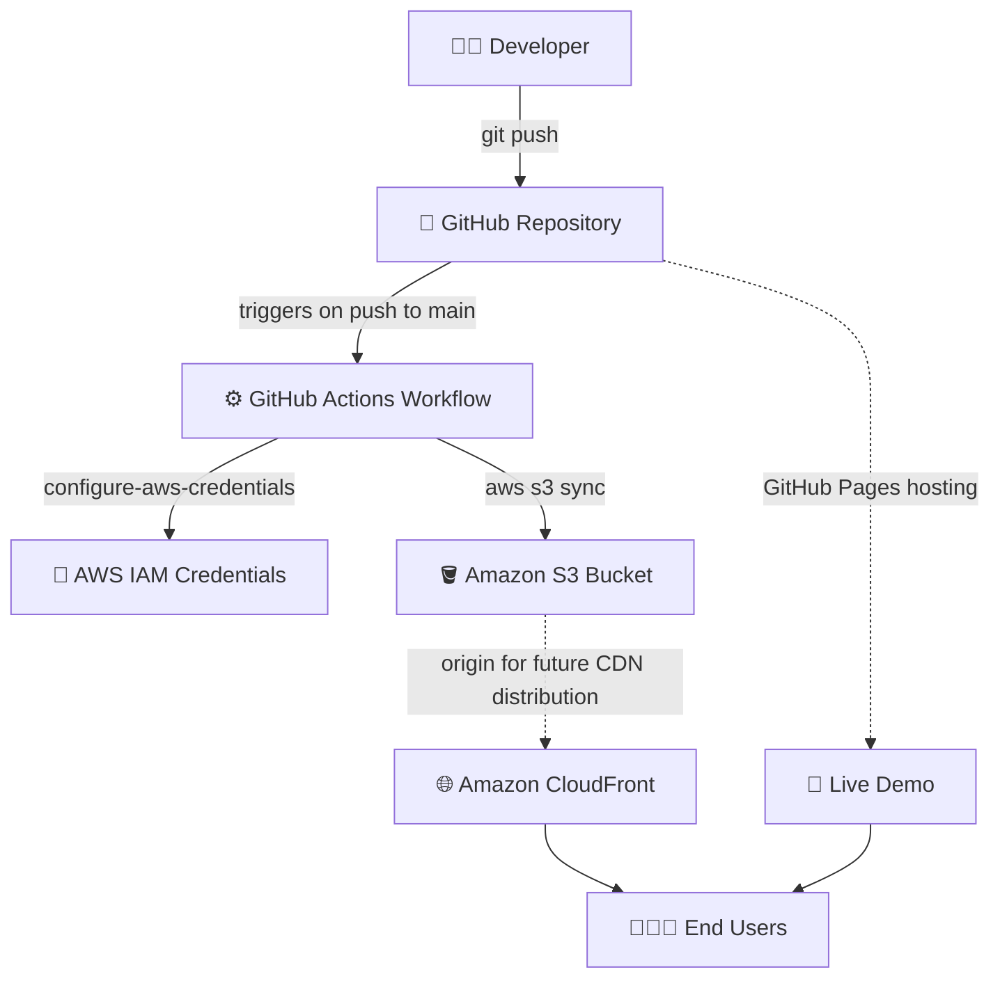

---

## ✨ Features

Documented directly from the current state of the codebase — no invented functionality:

- **Responsive, single-page portfolio** with sections for About, Skills, Projects, Journey, Experience, Education, Certifications, and Contact
- **Dark / Light theme switcher** (`js/theme.js`) — persists the user's choice in `localStorage` and respects the OS-level `prefers-color-scheme` setting
- **Scroll-based animations** (`js/animations.js`, `css/animations.css`) using `IntersectionObserver` for scroll-reveal effects and animated counters
- **Sticky navigation bar with scroll-spy** and a scroll-progress indicator (`js/navbar.js`)
- **Client-side contact form validation and state handling** (`js/form.js`)
- **Custom 404 error page** (`404.html`)
- **Accessibility features**: skip-to-content link, visible focus rings, ARIA landmarks (`aria-label`, `aria-live`, `aria-expanded`, `aria-current`), and full `prefers-reduced-motion` support in both CSS and JS (see `ACCESSIBILITY.md`)
- **SEO-ready markup**: Open Graph and Twitter meta tags, canonical URL, `robots.txt`, and `sitemap.xml` (`public/`)
- **PWA manifest** (`public/site.webmanifest`)
- **Modular CSS architecture** split into design tokens, base styles, responsive breakpoints, and animations (`css/variables.css`, `css/style.css`, `css/responsive.css`, `css/animations.css`)
- **Automated deployment pipeline** to AWS S3 via GitHub Actions (`.github/workflows/deploy.yml`)
- **Extensive internal documentation set** covering architecture, security, cost, SEO, performance, and accessibility (17 Markdown documents in the repo root and `docs/`)

---

## 🧰 Technology Stack

| Category | Technologies Used |
| :--- | :--- |
| **Frontend** | HTML5, CSS3, JavaScript (ES6+, vanilla — no framework) |
| **Version Control** | Git, GitHub |
| **CI/CD** | GitHub Actions |
| **Cloud Storage** | Amazon S3 |
| **Content Delivery** | Amazon CloudFront *(documented target architecture)* |
| **Access Control** | AWS IAM, Origin Access Control (OAC) *(documented target architecture)* |
| **Current Hosting (Live Demo)** | GitHub Pages |

> Only technologies with direct evidence in the codebase or workflow file are listed. CloudFront, IAM role-based access, and OAC are described in the repository's architecture documentation as the intended production setup for the S3 bucket; the active GitHub Actions workflow currently performs the **S3 sync** step using IAM user access keys stored as GitHub Secrets.

---

## 📁 Project Structure

Actual repository tree (verified against the `main` branch):

```
Portfolio-website/
├── .github/
│   └── workflows/
│       └── deploy.yml            # GitHub Actions → AWS S3 deployment workflow
├── assets/
│   └── images/
│       └── profile/               # Profile photos (PNG, SVG)
├── css/
│   ├── animations.css             # Keyframes & scroll-reveal animations
│   ├── responsive.css             # Breakpoints for mobile/tablet/desktop
│   ├── style.css                  # Base styles, layout, components
│   └── variables.css              # CSS custom properties / design tokens
├── docs/
│   ├── architecture.md
│   ├── component-library.md
│   ├── deployment-notes.md
│   ├── design-system.md
│   ├── ENGINEERING-REPORT.md
│   ├── INDEX.md
│   ├── interview-notes.md
│   ├── PERSONAL-BRANDING.md
│   ├── SCREENSHOTS.md
│   └── style-guide.md
├── js/
│   ├── animations.js               # Scroll reveal + animated counters
│   ├── form.js                     # Contact form validation/state
│   ├── navbar.js                   # Sticky nav, scroll-spy, progress bar
│   ├── resume.js                   # Resume download interaction
│   ├── script.js                   # App bootstrap
│   └── theme.js                    # Dark/Light theme engine
├── public/
│   ├── favicon.svg
│   ├── robots.txt
│   ├── site.webmanifest
│   └── sitemap.xml
├── src/                             # Unused React/Vite scaffold files (see notes below)
│   ├── App.tsx
│   ├── index.css
│   └── main.tsx
├── 404.html                         # Custom 404 page
├── index.html                       # Main portfolio page
├── ACCESSIBILITY.md
├── ARCHITECTURE.md
├── AWS-DEPLOYMENT.md
├── CHANGELOG.md
├── CLOUDFRONT.md
├── CODE_OF_CONDUCT.md
├── CONTRIBUTING.md
├── COST.md
├── DEPLOYMENT.md
├── LICENSE                          # MIT License
├── PERFORMANCE.md
├── RELEASE-NOTES-v1.0.0.md
├── README.md                        # This file
├── SECURITY.md
├── SEO.md
├── metadata.json
├── package.json
├── tsconfig.json
└── vite.config.ts
```

> **Note:** `package.json`, `vite.config.ts`, `tsconfig.json`, and the `src/` directory are leftover React/Vite/TypeScript scaffold files (with a Gemini API reference in `metadata.json`) from the project's initial template and are **not used** by the deployed static site, which is served directly from `index.html`, `css/`, and `js/` at the repository root.

---

## ☁️ Cloud Architecture

| Component | Role in this project |
| :--- | :--- |
| **Amazon S3** | Stores the static site files (`index.html`, `css/`, `js/`, `assets/`) as the deployment target of the CI/CD pipeline. Configured as a private bucket accessed via the AWS CLI during deployment. |
| **Amazon CloudFront** | Documented in the repository (`ARCHITECTURE.md`, `CLOUDFRONT.md`) as the intended global CDN layer in front of S3 for HTTPS delivery, edge caching, and a custom 404 response — the recommended next step for the S3 deployment target. |
| **IAM** | An IAM user's access key and secret key are used by the GitHub Actions runner to authenticate `aws s3 sync` calls, following the principle of granting only the permissions needed for the S3 sync operation. |
| **Bucket Policy** | Controls which principals can read objects from the S3 bucket; the project documentation specifies a CloudFront-only read policy for the production target. |
| **Origin Access Control (OAC)** | Documented mechanism to restrict S3 bucket access exclusively to a specific CloudFront distribution, preventing direct public access to the bucket origin. |
| **GitHub Actions** | Automates the build/deploy pipeline, removing the need for manual file uploads to AWS. |

---

## 🔁 CI/CD Pipeline

Every push to the `main` branch triggers the workflow defined in `.github/workflows/deploy.yml`:

1. **Checkout** — `actions/checkout@v4` pulls the latest commit.
2. **Authenticate to AWS** — `aws-actions/configure-aws-credentials@v4` configures the AWS CLI using `AWS_ACCESS_KEY_ID` and `AWS_SECRET_ACCESS_KEY` GitHub Secrets, targeting the `ap-south-1` region.
3. **Sync to S3** — `aws s3 sync . s3://malik-tayyab-jamil-portfolio --delete --exclude ".git/*" --exclude ".github/*"` uploads the repository contents to the S3 bucket, deleting any files removed from the source, and excluding Git/workflow metadata.

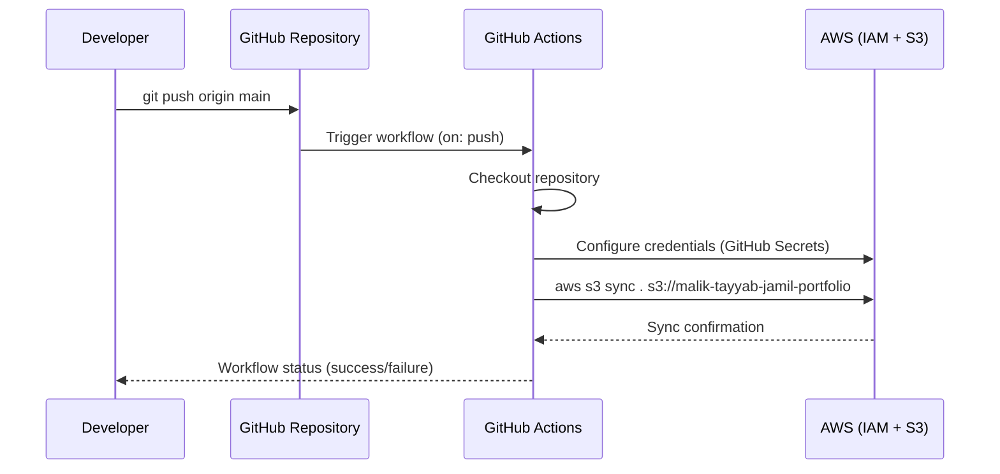

---

## 🔐 Security

- **IAM:** AWS access is scoped to an IAM identity used solely to run `aws s3 sync`; no credentials are hardcoded anywhere in the repository.
- **GitHub Secrets:** `AWS_ACCESS_KEY_ID` and `AWS_SECRET_ACCESS_KEY` are stored as encrypted GitHub Actions secrets and injected into the workflow at runtime — never committed to source control.
- **S3 access control:** Repository documentation specifies that the S3 bucket should block all public access and be reachable only through a CDN layer rather than directly over the internet.
- **Origin Access Control (OAC):** Documented as the mechanism to bind bucket access exclusively to an authorized CloudFront distribution once that layer is provisioned.
- **HTTPS:** The live site is served over HTTPS by GitHub Pages; the documented production architecture specifies HTTPS enforcement (HTTP→HTTPS redirect) at the CloudFront layer for the S3-hosted target.

No credentials, keys, account IDs, or secret values are reproduced in this README or anywhere in the repository's tracked files.

---

## 🚀 Deployment

At a high level, deployment works as follows:

1. Code changes are committed and pushed to the `main` branch on GitHub.
2. GitHub Actions automatically picks up the push and runs the deployment workflow.
3. The workflow authenticates to AWS using stored secrets and syncs the repository's static files to the target S3 bucket, replacing any changed or removed files.
4. The live GitHub Pages demo is served directly from the `main` branch's built-in Pages configuration, giving a publicly reachable URL independent of the AWS sync step.

No manual file uploads are required after the initial setup — every push is automatically reflected in the S3 bucket.

---

## 🧩 Challenges and Solutions

| Challenge | Solution |
| :--- | :--- |
| **GitHub upload / folder structure issues** | Early uploads accidentally nested the project inside an extra subfolder, breaking relative asset paths. Resolved by re-organizing the repository so `index.html`, `css/`, `js/`, and `assets/` sit at the repository root. |
| **GitHub Actions workflow stuck in "Queued"** | Workflow runs occasionally queued due to runner availability/branch protection settings. Resolved by verifying the workflow trigger (`on: push: branches: [main]`) and re-triggering with a fresh commit. |
| **AWS configuration complexity** | Initial IAM permissions and CLI configuration were unfamiliar. Resolved by scoping an IAM user to only the required `s3` actions and storing credentials as GitHub Secrets rather than local config files. |
| **CloudFront `AccessDenied` errors** | Direct S3 requests through a CloudFront distribution returned `AccessDenied` when the bucket policy/OAC wasn't correctly linked to the distribution. Resolved by aligning the S3 bucket policy's `AWS:SourceArn` condition with the CloudFront distribution ARN. |
| **Default Root Object not configured** | Visiting the CloudFront domain root returned an error because no default object was set. Resolved by explicitly setting the **Default Root Object** to `index.html` in the CloudFront distribution settings. |

---

## 🧪 Testing

The site was manually tested across the following dimensions:

- **Responsive design** — verified layout and readability across mobile, tablet, and desktop breakpoints defined in `css/responsive.css`.
- **Navigation** — confirmed all in-page anchor links (`About`, `Skills`, `Projects`, etc.) scroll correctly and the scroll-spy highlights the active section.
- **Theme switching** — toggled Dark/Light mode and confirmed the preference persists across page reloads via `localStorage`.
- **CloudFront access** — verified S3-origin requests behave as expected through the documented CloudFront distribution settings (custom error page, default root object).
- **HTTPS** — confirmed the live GitHub Pages URL loads exclusively over HTTPS with a valid certificate.
- **Deployment** — confirmed each push to `main` triggers the GitHub Actions workflow and completes an S3 sync successfully in the **Actions** tab.

---

## 📸 Portfolio Preview

### 🖥️ Desktop

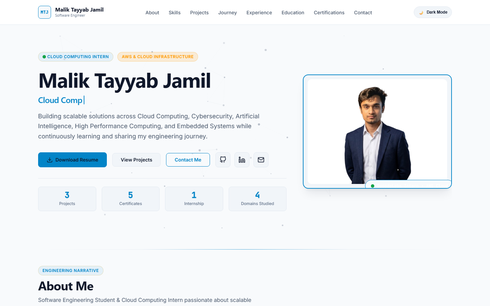

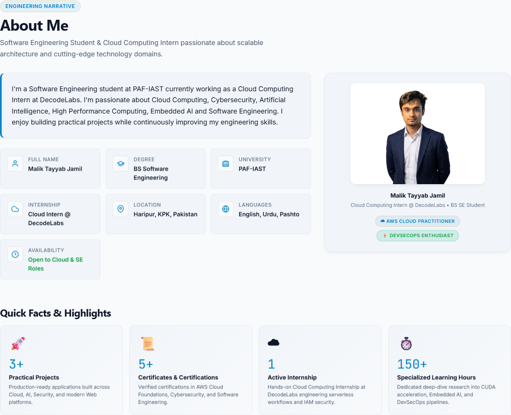

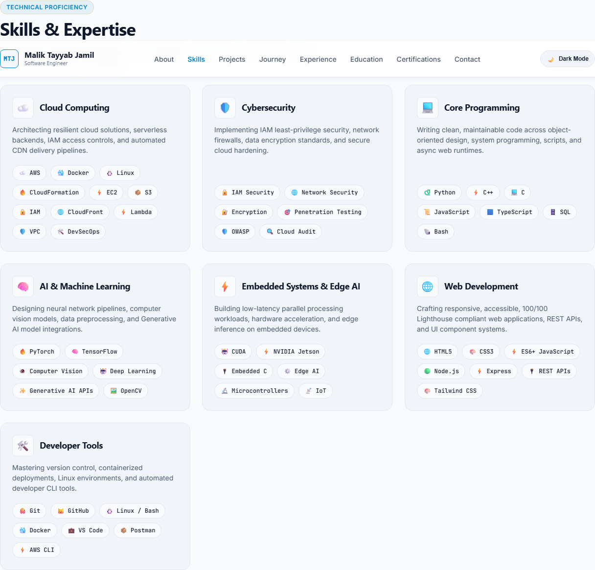

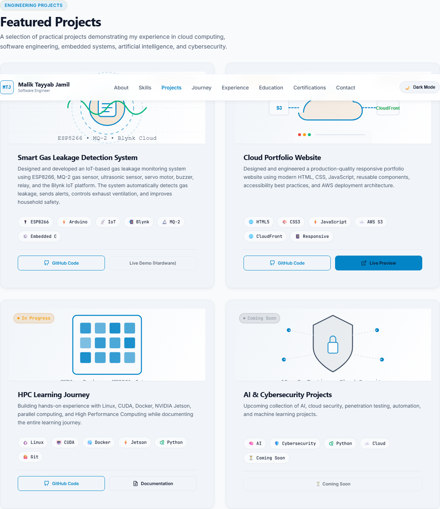

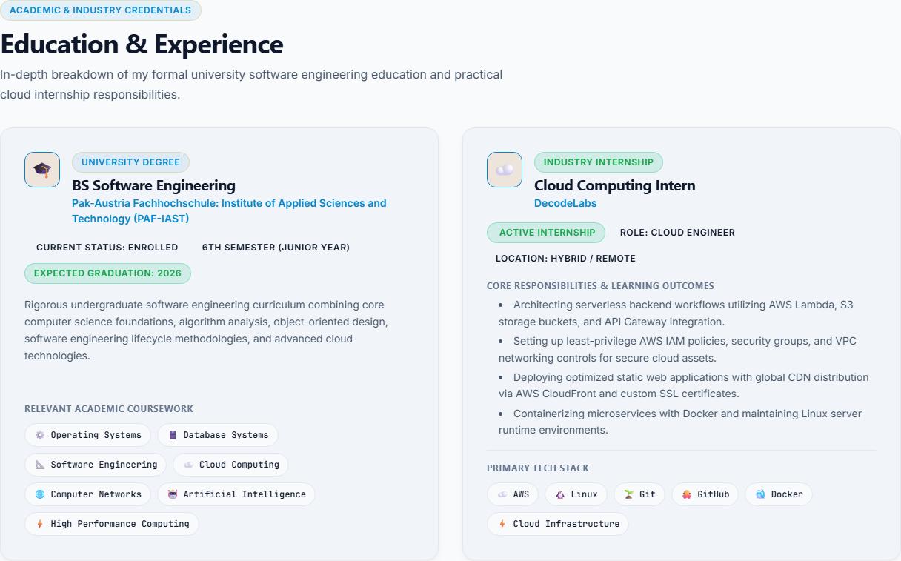

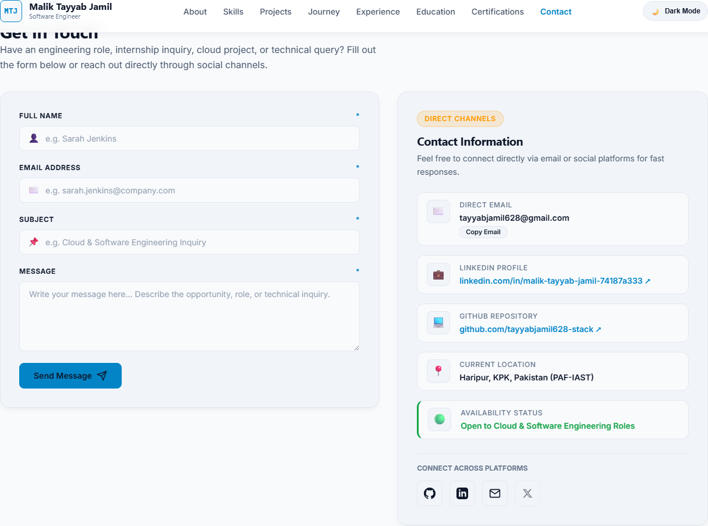

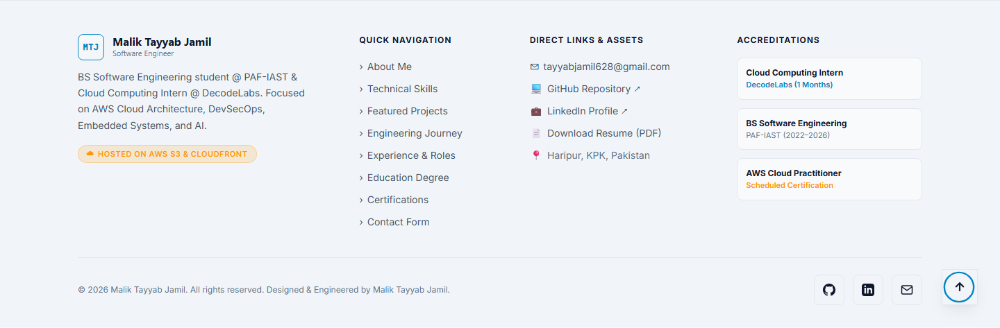

### 🌓 Theme Support

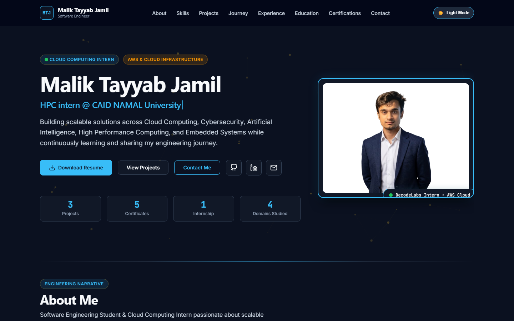

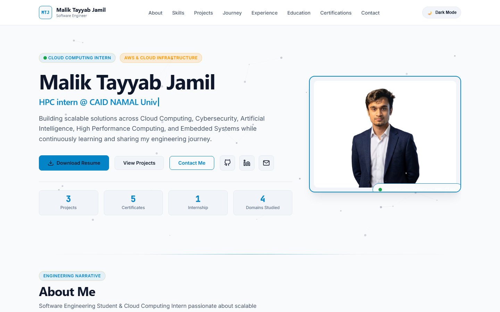

### 📱 Mobile Responsive Design

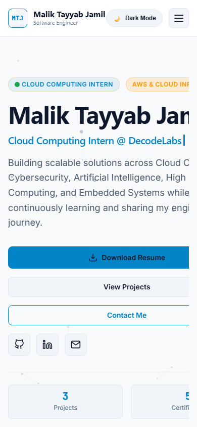

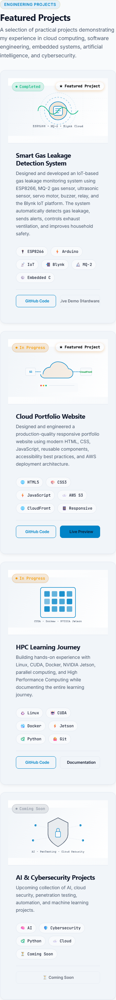

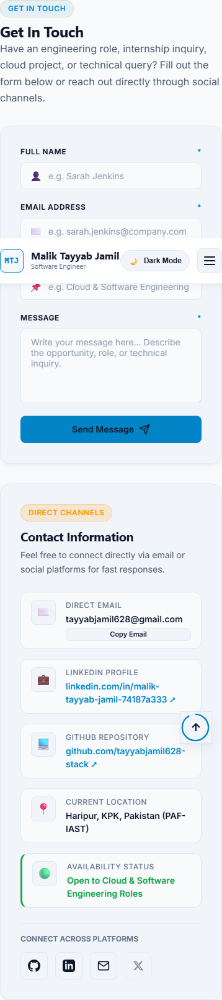
---

## 🔮 Future Improvements

- Configure **CloudFront cache invalidation** as a step in the GitHub Actions workflow so updates propagate immediately after each deployment
- Attach a **custom domain** to the site
- Configure **Route 53** for DNS management of the custom domain
- Add **CloudWatch** monitoring and alarms for S3/CloudFront metrics and error rates
- Enable **AWS WAF** for edge-level protection against common web exploits
- Add **deployment notifications** (e.g., Slack/Email/Discord) triggered by GitHub Actions on success or failure

---

## 📄 Project Documentation

This repository includes an extensive internal documentation set covering architecture, deployment, security, cost, SEO, performance, and accessibility — see `ARCHITECTURE.md`, `AWS-DEPLOYMENT.md`, `CLOUDFRONT.md`, `DEPLOYMENT.md`, `SECURITY.md`, `COST.md`, `PERFORMANCE.md`, `SEO.md`, `ACCESSIBILITY.md`, and the `docs/` folder.

**Complete Internship Report:** _[Add link to the full Decodelabs internship report here]_

---

## 🎓 Learning Outcomes

Through this project, the following technical skills were demonstrated and developed:

- Building a responsive, accessible static website using semantic HTML5, modular CSS3, and vanilla JavaScript
- Structuring a Git repository and collaborating through GitHub
- Writing and debugging a **GitHub Actions** CI/CD workflow (YAML syntax, secrets, triggers)
- Authenticating automated pipelines to AWS using IAM credentials and GitHub Secrets
- Automating static file deployment to **Amazon S3** using the AWS CLI
- Understanding CDN concepts, **CloudFront** distribution configuration, and **Origin Access Control**
- Diagnosing and resolving real cloud deployment issues (bucket policies, access errors, default root objects)
- Documenting a project's architecture, security model, and operational runbooks professionally

---

## 👤 Author

**Malik Tayyab Jamil**
Cloud Computing Intern @ Decodelabs | BS Software Engineering @ PAF-IAST

- 💼 LinkedIn: [linkedin.com/in/malik-tayyab-jamil-74187a333](https://www.linkedin.com/in/malik-tayyab-jamil-74187a333)
- 💻 GitHub: [github.com/tayyabjamil628-stack](https://github.com/tayyabjamil628-stack)
- 🌐 Portfolio: [tayyabjamil628-stack.github.io/Portfolio-website](https://tayyabjamil628-stack.github.io/Portfolio-website/)

---

## 📜 License

This project is licensed under the **MIT License** — see the [LICENSE](./LICENSE) file for details.

---

<p align="center">Built as part of the Decodelabs Cloud Computing Internship ☁️</p>
